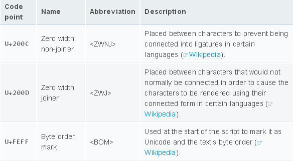
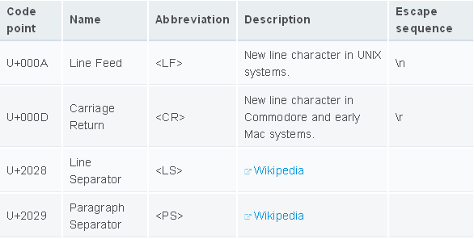

# 词法文法

## 控制字符

控制字符没有可视化表示，但控制着文本的视觉显示。

---

## 空白

空格、制表符和换行符被称为空白。

---

## 行终止符

在 ECMAScript 中，以下 Unicode 字符可以作为行终止符

---

## 注释

单选注释

    // 单行注释内容

多行注释

    /*
     多个注释内容
    */

---

## 关键词

ECMAScript 6 保留的关键字

    break
    case
    class
    catch
    const
    continue
    debugger
    default
    delete
    do
    else
    export
    extends
    finally
    for
    function
    if
    import
    in
    instanceof
    let
    new
    return
    super
    switch
    this
    throw
    try
    typeof
    var
    void
    while
    with
    yield

下面将来有可能成为关键字

    enum
    await

在严格模式下，下面将来有可能成为关键字

    implements
    package
    protected
    static
    interface
    private
    public

---

## 直接量

### Null直接量
    
    null
    
### 布尔直接量

    true
    false
    
### 数字直接量
    
    // 十进制
    1234567890
    42
    // 如果以0开头要注意
    0888 // 十进制数字888
    0777 // 八进制形式, 十进制数字是511
    
    // 二进制，'b'大小写都可以，ES6 新增
    var FLT_SIGNBIT  = 0b10000000000000000000000000000000; // 2147483648
    var FLT_EXPONENT = 0b01111111100000000000000000000000; // 2139095040
    var FLT_MANTISSA = 0B00000000011111111111111111111111; // 8388607
    
    // 八进制，'o'大小写都可以，ES6 新增
    var n = 0O755; // 493
    var m = 0o644; // 420
    
    // 十六进制，'X'大小写都可以
    0xFFFFFFFFFFFFFFFFF // 295147905179352830000
    0x123456789ABCDEF   // 81985529216486900
    0XA                 // 10
    
### 对象直接量
    
    var o = { a: "foo", b: "bar", c: 42 };
    
    // shorthand notation. New in ES6
    var a = "foo", b = "bar", c = 42;
    var o = {a, b, c};
    // instead of
    var o = { a: a, b: b, c: c };
    
### 数组直接量
    
    [1954, 1974, 1990, 2014]
    
### 字符串直接量
    
    'foo'
    "bar"
    
### 正则表达式直接量
    
    /ab+c/g
    
### 模板直接量

    `string text`
    
    `string text line 1
     string text line 2`
    
    `string text ${expression} string text`
    
    tag `string text ${expression} string text`

---

## 分号自动插入

JavaScript 使用分号`;`将语句分隔开，但是分号是可选的。如果省略分号，JavaScript 的处理规则是：

> 如果当前语句和下一行语句无法合并解析，JavaScript 则在第一行后填补分号。

这是通用规则，但有两个例外：

* return、break、continue
* ++、--

**return、break、continue**

    return
    true

JavaScript会解析成：

    return; true;
    
而本意是：

    return true;

**++、--**

    x
    ++
    y

JavaScript会解析成：

    x; ++y;
    
而不是：

    x++; y;

---